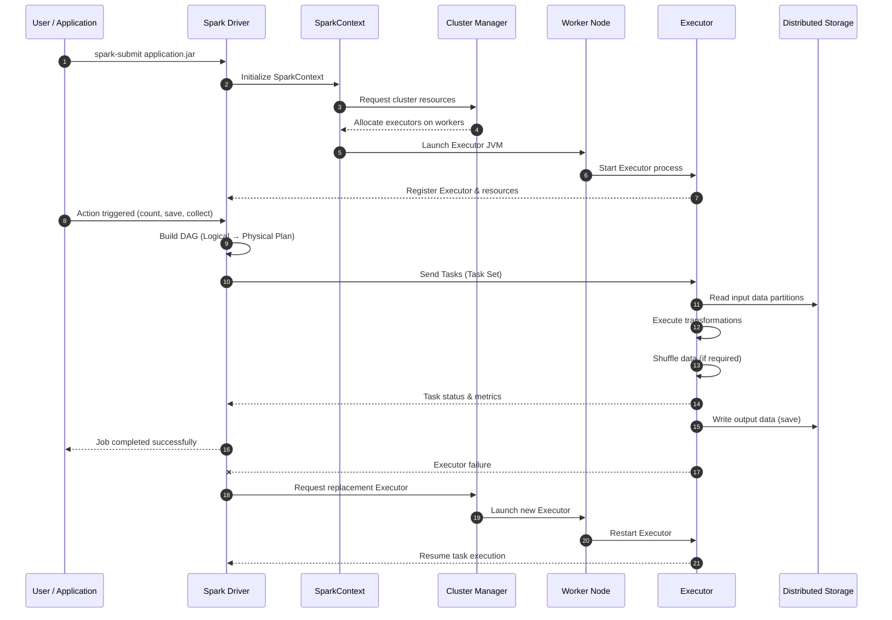

# 1. Spark Architecture – Deep Dive 🚀

## Understanding Distributed Computing in Spark

Apache Spark is a **distributed computing framework** that processes large datasets across clusters of machines in parallel. The architecture is built on a **master-slave (driver-executor) model** where the work is coordinated centrally and executed distributedly.

### 1. The Driver Process

The **Driver** is the process running your main application. It's responsible for:

- **Creating the SparkSession**: Entry point for all Spark operations
- **Parsing user code**: Translating PySpark/SQL code into a physical execution plan
- **Managing the Spark Context**: Coordinating communication with executors
- **Scheduling tasks**: Determining which tasks run on which executors
- **Collecting results**: Pulling results back from executors for actions like `collect()` and `show()`

The driver maintains the following critical data structures:

```python
# Example: Driver-side code
from pyspark.sql import SparkSession

spark = SparkSession.builder \
    .appName("MyApp") \
    .master("yarn") \
    .getOrCreate()

# The driver process is running this code
df = spark.read.parquet("s3://bucket/data.parquet")
```

When you call `spark.read.parquet()`, the driver:

1. Sends metadata reading requests to the cluster
2. Parses the schema
3. Plans task distribution across executors

### 2. Executor Processes

**Executors** are processes running on worker nodes in the cluster. Each executor:

- **Executes tasks**: Receives serialized tasks from the driver and runs them
- **Manages data in memory**: Stores RDD partitions, cached data, and shuffle data
- **Reports results back**: Sends task results to the driver or writes directly to storage

Key points about executors:

- Each executor has its own JVM instance
- Multiple executors can run on a single node
- Each executor manages a **fixed amount of memory** (heap size)
- Executors are launched when the Spark application starts and remain alive until completion

```python
# Example configuration showing executor resources
spark = SparkSession.builder \
    .appName("MyApp") \
    .config("spark.executor.memory", "4g") \
    .config("spark.executor.cores", "4") \
    .config("spark.executor.instances", "10") \
    .master("yarn") \
    .getOrCreate()

# This configures:
# - 4GB RAM per executor
# - 4 CPU cores per executor
# - 10 total executors
```

### 3. Cluster Manager

The **Cluster Manager** is responsible for:

- **Resource allocation**: Assigning resources (CPU, memory) to Spark executors
- **Node management**: Managing worker nodes in the cluster
- **Job scheduling**: Determining when executors are launched

Spark supports multiple cluster managers:

| Cluster Manager | When to Use                 | Characteristics                                                       |
| --------------- | --------------------------- | --------------------------------------------------------------------- |
| **Standalone**  | Development, small clusters | Built-in, simple to set up, minimal configuration                     |
| **YARN**        | Hadoop ecosystems           | Production, integrates with Hadoop, supports multi-tenant deployments |
| **Kubernetes**  | Cloud-native deployments    | Container orchestration, auto-scaling, cloud integration              |
| **Mesos**       | Mixed workloads             | Fine-grained resource sharing, multiple frameworks                    |

### 4. Memory Hierarchy & Memory Management

Spark divides memory into several categories on each executor:

#### Execution Memory

**Execution Memory** (also called **Runtime Memory**) is used for:

- **Shuffle operations**: Storing intermediate shuffle results during joins, groupBy, etc.
- **Aggregations**: Holding partial aggregations during reduce phases
- **Broadcasting**: Holding broadcast variables

Default allocation: **60% of available heap** (controlled by `spark.memory.fraction`)

```python
# Example: Understanding shuffle memory
# When you perform this operation:
df.groupBy("category").agg(sum("amount"))

# Behind the scenes, executors use execution memory to:
# 1. Hash each row based on "category" key
# 2. Hold all rows for the same category in memory
# 3. Perform the aggregation
# 4. Spill excess data to disk if memory is exceeded
```

#### Storage Memory

**Storage Memory** is used for:

- **Cached DataFrames**: When you call `df.cache()` or `df.persist()`
- **RDD Partitions**: When caching RDD transformations
- **Block storage**: Temporary storage during broadcast operations

Default allocation: **40% of available heap** (within the `spark.memory.fraction`)

```python
# Example: Caching uses storage memory
df.cache()  # Allocates storage memory for this DataFrame
df.count()  # Triggers caching to storage memory
```

#### Memory Configuration

```python
spark = SparkSession.builder \
    .config("spark.memory.fraction", 0.75) \
    .config("spark.memory.storageFraction", 0.5) \
    .getOrCreate()

# spark.memory.fraction = 0.75 means 75% of heap is reserved for Spark
# Remaining 25% is for Python, OS, user code
#
# spark.memory.storageFraction = 0.5 means:
# - 50% of the 75% (37.5% total) → Storage memory
# - 50% of the 75% (37.5% total) → Execution memory
```

#### Off-Heap Memory

Spark can use off-heap memory for:

- **Shuffle data**: When configured via `spark.shuffle.service.enabled`
- **Caching**: External block store

```python
spark = SparkSession.builder \
    .config("spark.memory.offHeap.enabled", "true") \
    .config("spark.memory.offHeap.size", "2g") \
    .getOrCreate()
```

### 5. Schedulers & Task Execution

Spark uses a **DAG (Directed Acyclic Graph) scheduler** to manage execution:

#### DAG Scheduler

Converts transformations into a DAG of stages:

1. **Builds the logical plan**: From all transformations
2. **Identifies stage boundaries**: Stages are separated by shuffle operations
3. **Creates tasks**: Each stage produces a set of tasks
4. **Submits to Task Scheduler**: Passes stages to the task scheduler

```
Example transformation pipeline:
rdd1 = sc.parallelize([1, 2, 3, 4, 5])
rdd2 = rdd1.map(lambda x: (x % 2, x))  # Stage 1 (no shuffle)
result = rdd2.reduceByKey(lambda a, b: a + b)  # Stage 2 (shuffle barrier)

DAG:
Stage 1 [No Shuffle]: map()
    ↓
[SHUFFLE BARRIER]
    ↓
Stage 2 [Shuffle]: reduceByKey()
```

#### Task Scheduler

The **Task Scheduler** (FIFO or Fair) assigns tasks to executors:

- **FIFO Scheduler**: First-in, first-out; all tasks from the first job run first
- **Fair Scheduler**: Round-robin between jobs; prevents one job from starving others

```python
spark = SparkSession.builder \
    .config("spark.scheduler.mode", "FAIR") \
    .getOrCreate()
```

#### Task Assignment & Locality

The scheduler attempts to schedule tasks with **data locality**:

1. **PROCESS_LOCAL**: Data is in executor JVM (best)
2. **NODE_LOCAL**: Data is on same node, different executor/JVM
3. **RACK_LOCAL**: Data is on same rack, different node
4. **ANY**: Data locality not achievable

```python
# Example: Understanding locality
# If your Parquet files are on HDFS:
df = spark.read.parquet("hdfs://namenode:9000/data/parquet")

# Spark tries to schedule tasks where the Parquet blocks are located
# If a block is on Node A, Spark schedules that task to an executor on Node A
# This avoids network I/O and maximizes performance
```

### 6. Complete Spark Architecture Diagram

```
┌─────────────────────────────────────────────────────────────────────┐
│                          CLIENT (Driver)                            │
│  ┌──────────────────────────────────────────────────────────────┐   │
│  │ SparkSession                                                 │   │
│  │  - Creates RDD/DataFrame/Dataset                             │   │
│  │  - Builds logical plans (AST)                                │   │
│  │  - Manages SparkContext                                      │   │
│  └──────────────────────────────────────────────────────────────┘   │
│  ┌──────────────────────────────────────────────────────────────┐   │
│  │ DAG Scheduler                                                │   │
│  │  - Converts transformations to DAG                           │   │
│  │  - Identifies shuffle boundaries                             │   │
│  │  - Creates stages and tasks                                  │   │
│  └──────────────────────────────────────────────────────────────┘   │
│  ┌──────────────────────────────────────────────────────────────┐   │
│  │ Task Scheduler (FIFO or Fair)                                │   │
│  │  - Assigns tasks to executors                                │   │
│  │  - Considers data locality                                   │   │
│  │  - Retries failed tasks                                      │   │
│  └──────────────────────────────────────────────────────────────┘   │
└─────────────────────────────────────────────────────────────────────┘
         ↓                    ↓                      ↓
┌─────────────────────┐ ┌─────────────────┐ ┌─────────────────────┐
│   CLUSTER MANAGER   │ │   CLUSTER MGR   │ │   CLUSTER MGR       │
│   (YARN/K8s/etc)    │ │                 │ │                     │
│  - Allocates        │ │ - Allocates     │ │ - Allocates         │
│    resources        │ │   resources     │ │   resources         │
└─────────────────────┘ └─────────────────┘ └─────────────────────┘
         ↓                    ↓                      ↓
┌─────────────────────┐ ┌─────────────────┐ ┌─────────────────────┐
│   WORKER NODE 1     │ │   WORKER NODE 2 │ │   WORKER NODE 3     │
│  ┌───────────────┐  │ │  ┌───────────┐  │ │  ┌───────────────┐  │
│  │  Executor 1   │  │ │  │ Executor2 │  │ │  │  Executor 3   │  │
│  │ JVM Process   │  │ │  │JVM Process│  │ │  │ JVM Process   │  │
│  │ [Tasks] [Mem] │  │ │  │[Tasks][Mem]  │ │  │ [Tasks] [Mem] │  │
│  └───────────────┘  │ │  └───────────┘  │ │  └───────────────┘  │
│  ┌───────────────┐  │ │                 │ │                     │
│  │  Executor 4   │  │ │                 │ │                     │
│  │ JVM Process   │  │ │                 │ │                     │
│  │ [Tasks] [Mem] │  │ │                 │ │                     │
│  └───────────────┘  │ │                 │ │                     │
└─────────────────────┘ └─────────────────┘ └─────────────────────┘
```

### 7. Example: Complete Request Flow

```python
# User code in driver
df = spark.read.parquet("s3://bucket/sales.parquet")
result = df.filter(df.amount > 100) \
    .groupBy("category") \
    .agg(sum("amount")) \
    .collect()

# EXECUTION FLOW:
# 1. Driver: Parses these 4 transformations into a logical plan
# 2. Driver (Catalyst): Optimizes the logical plan (predicate pushdown, etc.)
# 3. Driver (DAG Scheduler): Identifies 2 stages
#    - Stage 1: Read + Filter (no shuffle)
#    - Stage 2: GroupBy aggregation (requires shuffle)
# 4. Driver (Task Scheduler): Creates tasks for each stage
# 5. Driver: Sends tasks to executors
# 6. Executor 1-N: Run filter tasks on their data partitions
# 7. [SHUFFLE BOUNDARY]
# 8. All executors: Exchange data based on groupBy keys
# 9. Executor 1-N: Perform aggregation on shuffled data
# 10. Executor 1-N: Send results back to driver
# 11. Driver: Calls collect() and returns results to user
```


